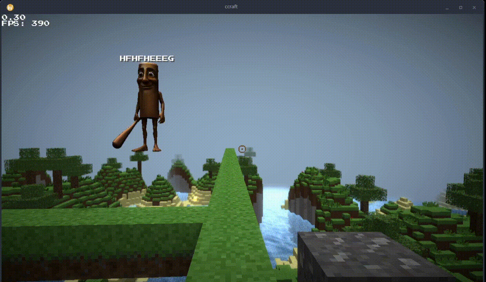

## ccraft

ccraft is a W.I.P sandbox minecraft voxel like game. currently not much had been implemented, but it features

- the core "minecraft" game (chunks management, placing and breaking blocks, player movement with physics, collisions, infinite world generation),
- deferred rendering (effects like shadows, SSAO, SSR, bloom, DOF, vignette),
- gui (text renderer, crosshair),
- world saving and loading (currently only worlds/main.dat is supported),
- and even a W.I.P multiplayer ;)

### Multiplayer

As i said, multiplayer is under construction, it is still very buggy, but if you want to try it:

- run the "server" binary, port and the world seed can be configured inside server/globals.h.
- connect to the server using the -connect <IP:PORT> flag.
- you can also use 'localhost' as the ip.
- custom nickname can be setupped using the -nickname <NAME> flag, otherwise the nickname will be created automatically.
- enjoy.

The server runs on 32 TPS with interpolation.

## CREDITS

Music: “Taswell” by C418 (from Minecraft: Volume Beta)

Sound effects are from Minecraft by Mojang Studios.
Minecraft is a trademark of Mojang Studios.
