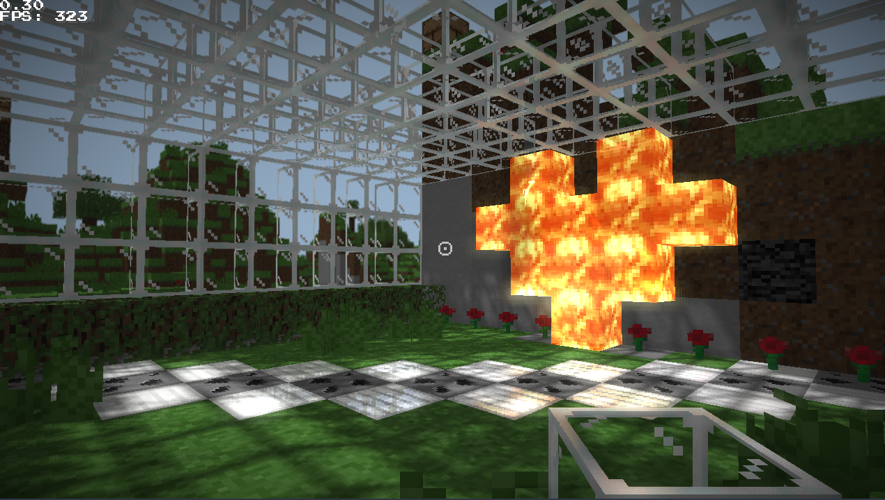

## ccraft

ccraft is a work-in-progress sandbox minecraft like voxel game, written fully in C with OpenGL and a couple of lib dependencies.

### Goals

the goal of this project is to have a flexible, cross platform, easily moddable game with stable multiplayer support while serving as an experimental 3d engine with advanced features (for example skeletal animations, which are already implemented ;) )

### Things i already implemented

- the core "minecraft" game (chunks management, placing and breaking blocks, player movement with physics, collisions, infinite world generation, lightmaps, world saving and loading),
- deferred rendering (effects like shadows, SSAO, SSR, bloom, DOF, vignette),
- basic HUD,
- sounds, ambience.
- WIP Multiplayer.

- other advanced features like skeletal animation, PDB softbody physics, particle systems.

### Planned features

the list is huge, but things i need to implement ASAP:

- cleaning up the entire project codebase,
- more optimizations,
- GUI.

### Multiplayer

as i said, multiplayer is under construction, it is still very buggy, but if you want to try it:

- run the "server" binary, everything configurable is avaliable inside file "server.properties".
- connect to the server using the -connect <IP:PORT> flag.
- you can also use 'localhost' as the ip.
- custom nickname can be setupped using the -nickname <NAME> flag, otherwise the nickname will be created automatically.
- chat is avaliable on the server by using the T key, pressing ENTER will send your message to the server from your name.
- enjoy.

the server runs on 32 TPS with interpolation.

### License

MIT license, because sharing is caring.

### Contribution

anyone can contribute or fork the project, any help will be greeted with open hands.

## CREDITS

Music: “Taswell” by C418 (from Minecraft: Volume Beta)

Sound effects are from Minecraft by Mojang Studios.
Minecraft is a trademark of Mojang Studios.
