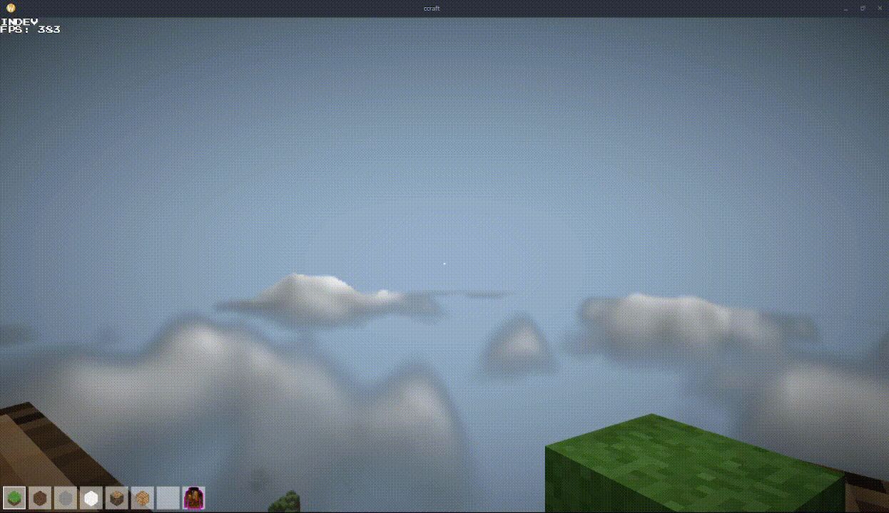
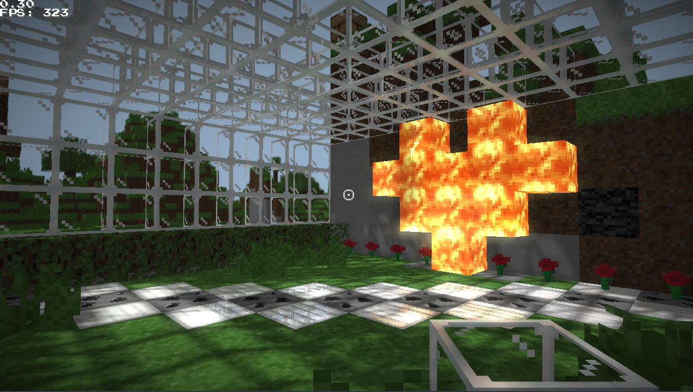
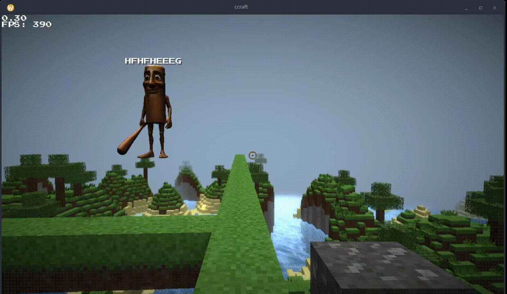

## ccraft

CCraft is a work-in-progress sandbox minecraft like voxel game, written fully in C with OpenGL and a couple of lib dependencies.

### Goals

The goal of this project is to have a flexible, cross platform, easily moddable game with stable multiplayer support suitable for low end devices.

### Things i already implemented

- The core "minecraft" game (chunks management, placing and breaking blocks, player movement with physics, collisions, infinite world generation, lightmaps, etc),
- Deferred rendering,
- HUD,
- Sounds, ambient,
- WIP Multiplayer.

- Skeletal animations,
- Soft body experimental implementation.

### Planned features

The list is huge, but things i need to implement ASAP:

- Day-Night cycle,
- Server rework to generate and send chunks on the server,
- Rigidbody physics,
- More optimizations,
- GUI.

### Multiplayer

As i said, multiplayer is under construction, it is still very buggy, but if you want to try it:

- Run the "server" binary, everything configurable is avaliable inside file "server.properties".
- Connect to the server using the -connect <IP:PORT> flag.
- You can also use 'localhost' as the ip.
- Custom nickname can be setupped using the -nickname <NAME> flag, otherwise the nickname will be created automatically.
- Chat is avaliable on the server by using the T key, pressing ENTER will send your message to the server from your name.
- Enjoy.

The server runs on 32 TPS with interpolation.

### License

MIT license, because sharing is caring.

### Contribution

Anyone can contribute or fork the project, any help will be greeted with open hands.

## CREDITS

Music: “Taswell” by C418 (from Minecraft: Volume Beta)

Sound effects are from Minecraft by Mojang Studios.
Minecraft is a trademark of Mojang Studios.
